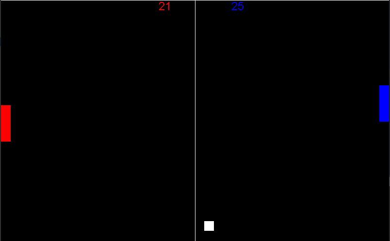

# PongGame

A Pong game made in java, tested in Windows. 

**Running:**
Install java sdk then go to src folder in terminal and type:

```
javac PongGame/Start.java
```
```
java PongGame.Start
```

**Controls:**

W and S left side for player red

UP and DOWN right side for player blue

**Game preview:**


